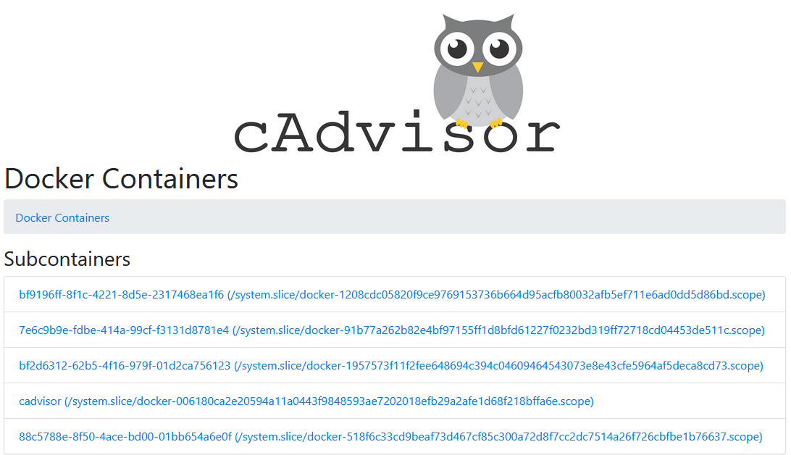
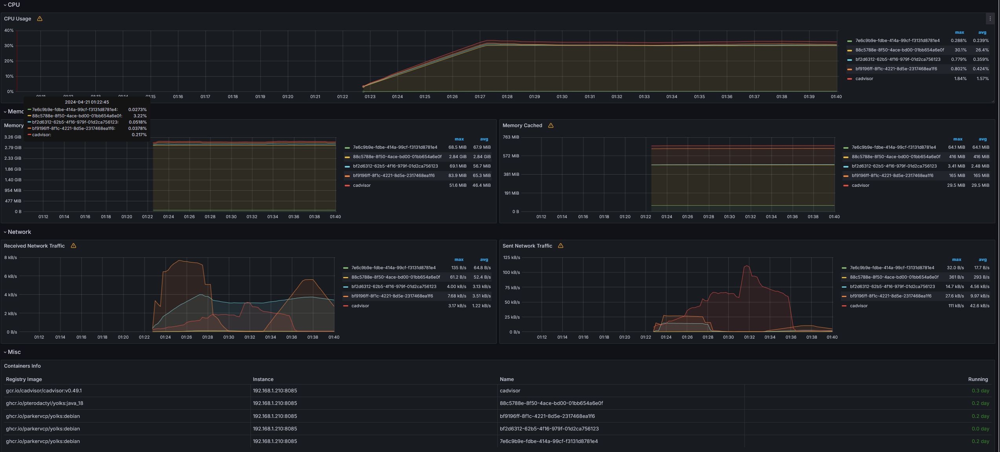

cAdvisor (Container Advisor) provides container users an understanding of the resource usage and performance characteristics of their running containers. It is a running daemon that collects, aggregates, processes, and exports information about running containers. Specifically, for each container it keeps resource isolation parameters, historical resource usage, histograms of complete historical resource usage and network statistics. This data is exported by container and machine-wide.

cAdvisor has native support for [Docker](https://github.com/docker/docker) containers and should support just about any other container type out of the box. We strive for support across the board so feel free to open an issue if that is not the case. cAdvisor's container abstraction is based on [lmctfy](https://github.com/google/lmctfy)'s so containers are inherently nested hierarchically.

#### Quick Start: Running cAdvisor in a Docker Container

To quickly tryout cAdvisor on your machine with Docker, we have a Docker image that includes everything you need to get started. You can run a single cAdvisor to monitor the whole machine. Simply run:

```
VERSION=v0.49.1 # use the latest release version from https://github.com/google/cadvisor/releases
sudo docker run \
  --volume=/:/rootfs:ro \
  --volume=/var/run:/var/run:ro \
  --volume=/sys:/sys:ro \
  --volume=/var/lib/docker/:/var/lib/docker:ro \
  --volume=/dev/disk/:/dev/disk:ro \
  --publish=8080:8080 \
  --detach=true \
  --name=cadvisor \
  --privileged \
  --device=/dev/kmsg \
  gcr.io/cadvisor/cadvisor:$VERSION
```
Now check if you have a result like this on next link : localhost:8080


cAdvisor is now running (in the background) on `http://localhost:8080`. The setup includes directories with Docker state cAdvisor needs to observe.


#### Prometheus config

```bash
  - job_name: 'Name'
    static_configs:
      - targets: ['IP:PORT']  
```
And restart it.

#### Grafana

Include [this dashboard](Infrastructure\Supervision\Grafana\Dashboard\LogicalHardware\Cadvisor-exporter.json)

Now, you have a cool grafana dashboard and you can see all of your docker in one view !

There is an example :




### [Link to the original repository](https://github.com/google/cadvisor)