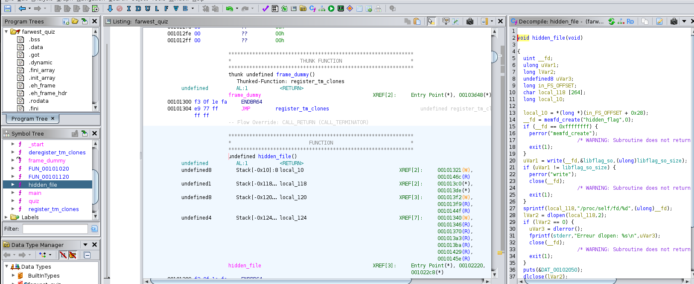
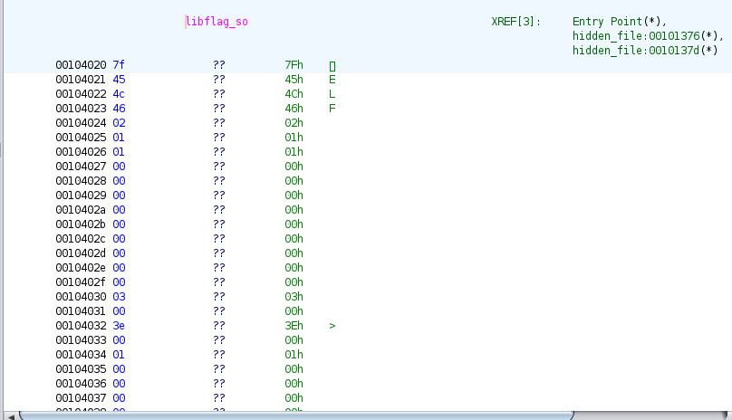
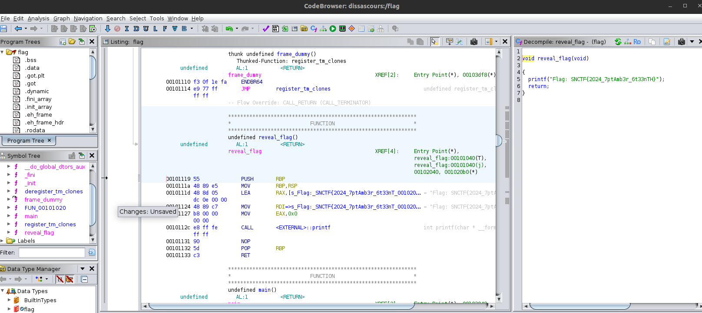
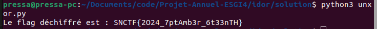

## Solution - Writeup

En parcourant les événements, on voit dans l'url des IDs qui s'incrémentent de 2 et/ou restent impair.
En testant de changer un ID par un nombre pair on tombe bien sur un événement qui n'est pas répertorié.
En cherchant, on tombe sur une ligne suspecte à cette url : *http://127.0.0.1:5000/event/4*

*"Un cow-boy futé sait que certaines informations se trouvent à des dates spécifiques."*

En chechant on trouve qu'il existe un /flag, il faut ensuite rajouter la bonne date (2024-07-30) => *http://127.0.0.1:5000/flag/2024-07-30*

En arrivant sur ce lien un elf se télécharge, il s'agit d'un quizz qui doit être reverse.

Avec cutter / ghidra / ida, on peut voir qu'une fonction hidden_flag() existe, celle-ci récupère un fichier en mémoire :

On peut retrouver son hexadecimal : 

Une fois l'hexa convertit dans un fichier binaire, on peut le reverse et voir le flag peut être afficher mais chiffré en XOR avec une clé :

Une fois l'hexadecimal du flag et la clé récupérer il reste plus qu'a déchiffrer le flag :

